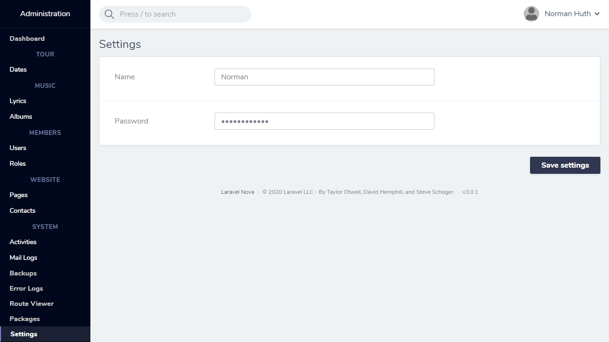

# Nova Valuestore Settings

This [Laravel Nova](https://nova.laravel.com) package allow you to edit a config file (JSON) by using [valuestore](https://github.com/spatie/valuestore)

## Requirements

    "laravel/nova": "^2.0.11 || ^3.0",
    "spatie/valuestore": "^1.0"

## Features

- Settings fields management in code
- UI for editing settings
- Rule validation support
- Supports [nova-translatable](https://github.com/optimistdigital/nova-translatable) w/ rule validation

## Screenshot



## Installation

Install the package in a Laravel Nova project via Composer:

```bash
composer require normanhuth/nova-valuestore-settings
```

Register the tool with Nova in the `tools()` method of the `NovaServiceProvider`:

```php
// in app/Providers/NovaServiceProvider.php

public function tools()
{
    return [
        // ...
        new \NormanHuth\NovaValuestore\NovaValuestore
    ];
}
```

## Usage

### Registering fields

Define the fields in your `NovaServiceProvider`'s `boot()` function by calling `NovaValuestore::setSettingsFields()`.

```php
        \NormanHuth\NovaValuestore\NovaValuestore::addSettingsFields([
            Text::make('Public Name'),
        ]);
```


## Configuration

The config file can be published using the following command:

```bash
php artisan vendor:publish --provider="NormanHuth\NovaValuestore\ToolServiceProvider" --tag="config"
```

Config options:
```
    'reload_page_on_save' => false,
    'settings_file'       => config_path('settings.json'),
```

## Password field
```
    NormanHuth\NovaValuestore\Fields\PlainPassword::make('ass'),
```

##### Alternative to [opanegro/field-nova-password-show-hide](https://github.com/opanegro/field-nova-password-show-hide)
Install
```bash
composer require normanhuth/settings-valuestore-pwd-show-hide:dev-master
```
Usage:
```
    NormanHuth\PlainFieldNovaPasswordShowHide\PlainFieldNovaPasswordShowHide::make('ass'),
```

#

## Localization

The translation file(s) can be published by using the following command:

```bash
php artisan vendor:publish --provider="NormanHuth\NovaValuestore\ToolServiceProvider" --tag="translations"
```

You can add your translations to `resources/lang/vendor/nova-settings/` by creating a new translations file with the locale name (ie `et.json`) and copying the JSON from the existing `en.json`.

## Credits

This Package is a fork of [optimistdigital/nova-settings](https://github.com/optimistdigital/nova-settings)

- [Tarvo Reinpalu](https://github.com/Tarpsvo)

## License

Nova Valuestore Settings and Nova Settings is open-sourced software licensed under the [MIT license](LICENSE.md).
